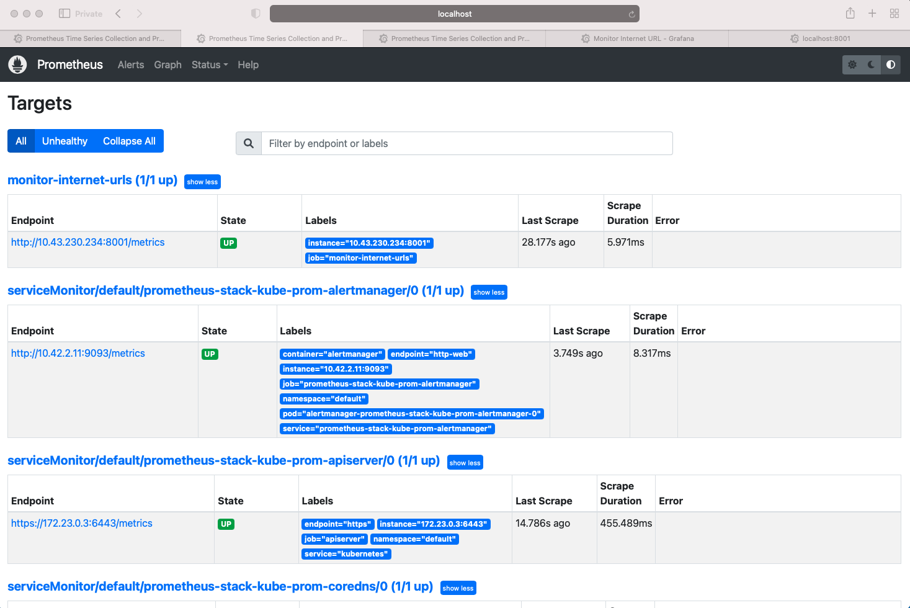

# Monitor Internet URLs

Monitor a list of internet URLs with Python instrumented using Prometheus and Grafana served on a Kubernetes Cluster

---

## Summary

-   A service written in Python that queries two sample urls every 5 seconds:    
    -   https://httpstat.us/200
    -   https://httpstat.us/503
-   The service checks:
    -   The external urls are up (based on http status code 200) return `1` if up, `0` if otherwise
    -   Response time in milliseconds
-   The service will run a simple http service that produces metrics (on `/metrics`) and output a Prometheus format when curling the service `/metrics` url

**Sample Response Format**:
```shell
sample_external_url_up{url="https://httpstat.us/200 "}  = 1
sample_external_url_response_ms{url="https://httpstat.us/200 "}  = [value]
sample_external_url_up{url="https://httpstat.us/503 "}  = 0
sample_external_url_response_ms{url="https://httpstat.us/503 "}  = [value]
```

## Technology Used

-   [Python3](https://www.python.org/)
-   [Prometheus](https://github.com/prometheus/client_python.git)
-   [Kubernetes](https://kubernetes.io/)
-   [Helm3](https://helm.sh/)
-   [Grafana](https://grafana.com/)

---

## Application's Screenshots

### Grafana Dashboard


### Prometheus Metrics

##### Prometheus Metrics


##### URL Response time in Prometheus


##### URL Status in Prometheus


##### Prometheus Targets


### Python Web Service

##### Python Web Service


---

## Set-up

1. Configure urls part in [urls.json](urls.json) with URLs you wish to monitor. This is currently configured with two urls as an example.

```
    {
    "urls": ["https://httpstat.us/200","https://httpstat.us/503"]
    }
```

2. Build Docker image and push to repository of your choosing

```shell
docker build -t $USERNAME/pythonmonitorurls .
docker push $USERNAME/pythonmonitorurls:$tagname
```

3. Create kubernetes cluster using any Kubernetes cluster creation method.

- [Kubeadm](https://kubernetes.io/docs/setup/production-environment/tools/kubeadm/install-kubeadm/)
- [EKS](https://docs.aws.amazon.com/eks/latest/userguide/create-cluster.html)
- [k3d](https://k3d.io/v5.0.0/usage/commands/k3d_cluster_create/)


4. Use `helm3` to install Prometheus & Grafana using kube-prometheus-stack

```shell
#Install Helm3
https://helm.sh/docs/intro/install/
$ curl -fsSL -o get_helm.sh https://raw.githubusercontent.com/helm/helm/master/scripts/get-helm-3
$ chmod 700 get_helm.sh
$ ./get_helm.sh

#Install Prometheus & Grafana
helm repo add prometheus-community https://prometheus-community.github.io/helm-charts
helm repo update
helm install [RELEASE_NAME] prometheus-community/kube-prometheus-stack
```

### Deployment and Testing

To test with kubernetes cluster ensure that it is properly installed according to your operating system.

1.  Create kubernetes secret & update `imagePullSecrets` in [deployment.yaml](deployment.yaml).
```shell
kubectl create secret docker-registry regcred --docker-server=<your-registry-server> --docker-username=<your-name> --docker-password=<your-pword> --docker-email=<your-email>

eg:- kubectl create secret docker-registry regcred --docker-server=hub.docker.com --docker-username=abc --docker-password=xyz --docker-email=abc@gmail.com
```
2. In [deployment.yaml](deployment.yaml) change `image: akshaygirpunje/pythonmonitorurls:latest` to newly built Docker image you done in the set-up and also change the secret name.

3.  Run `kubectl deployment.yaml and service.yaml`

```shell
kubectl apply -f ./yaml
deployment.apps/monitor-internet-urls created
service/monitor-internet-urls created
```
-   View the deployment

```shell
kubectl get deployments

NAME                                  READY   UP-TO-DATE   AVAILABLE   AGE
monitor-internet-urls                 1/1     1            1           3h17m
```

4.  View the Services 

```shell
kubectl get services
NAME                                        TYPE        CLUSTER-IP      EXTERNAL-IP   PORT(S)                      AGE
kubernetes                                  ClusterIP   10.43.0.1       <none>        443/TCP                      7h29m
prometheus-stack-kube-state-metrics         ClusterIP   10.43.241.17    <none>        8080/TCP                     4h21m
prometheus-stack-kube-prom-alertmanager     ClusterIP   10.43.234.49    <none>        9093/TCP                     4h21m
prometheus-stack-kube-prom-prometheus       ClusterIP   10.43.218.100   <none>        9090/TCP                     4h21m
prometheus-stack-kube-prom-operator         ClusterIP   10.43.113.173   <none>        443/TCP                      4h21m
prometheus-stack-prometheus-node-exporter   ClusterIP   10.43.120.225   <none>        9100/TCP                     4h21m
alertmanager-operated                       ClusterIP   None            <none>        9093/TCP,9094/TCP,9094/UDP   4h20m
prometheus-operated                         ClusterIP   None            <none>        9090/TCP                     4h20m
monitor-internet-urls                       ClusterIP   10.43.230.234   <none>        8001/TCP                     4h9m
prometheus-stack-grafana                    ClusterIP   10.43.66.86     <none>        3000/TCP                     4h21m
```

5. Test services through `CLI` or `Web Browser`

- Check using CLI

```shell
curl http://localhost:8001/metrics
# HELP sample_external_url_response_ms HTTP response in milliseconds
# TYPE sample_external_url_response_ms gauge
sample_external_url_response_ms{url="https://httpstat.us/200"} 1.299531
sample_external_url_response_ms{url="https://httpstat.us/503"} 1.463194
# HELP sample_external_url_up Boolean status of site up or down
# TYPE sample_external_url_up gauge
sample_external_url_up{url="https://httpstat.us/200"} 1.0
sample_external_url_up{url="https://httpstat.us/503"} 0.0
```

-   Check `monitor-internet-urls`, `prometheus-stack-kube-prom-prometheus` and `prometheus-stack-grafana` services using web browser with the help of port forwarder for monitor-service,prometheus and grafana to access it

```shell
kubectl port-forward svc/monitor-internet-urls 8001
kubectl port-forward svc/prometheus-operated 9090
kubectl  port-forward svc/prometheus-stack-grafana  3000
```

---
6. Add the service `monitor-internet-urls` endpoint to prometheus's target by adding `job_name` in [value.yaml](values.yaml) at `additionalScrapeConfigs` section as follows.

```shell
    additionalScrapeConfigs:
    - job_name: 'monitor-internet-urls'
      honor_labels: true
      static_configs:
      - targets: ['10.43.230.234:8001']
```

7. Update the `kube-prometheus-stack` release by using helm upgrade.
   - It will add the endpoint to prometheus's target.
   - Check the target in prometheus dashboard at path http://localhost:9090/targets
```shell
 helm upgrade  prometheus stable/prometheus-operator -f values.yaml
```

8. Configure & test `sample_external_url_up` & `sample_external_url_response_ms` metrics in prometheus at following path
```shell
 http://localhost:9090/graph
```
9. Configure & test `sample_external_url_up` & `sample_external_url_response_ms` metrics in Grafana & create new Dashboard.
```shell
1. Go to your browser and access granfana using http://localhost:3000
2.  Enter below username and password User : admin Password : prom-operator
3. Go to Create -> Import
4. Go to Import via panel json section
5. Copy the JSON data from dasboard.json file in service_monitor folder
6. Paste it to Import via panel json section and click on import
```
---

### Local Testing (Python Script)


1. Run ` python python_monitor_url.py`

```shell
python python_monitor_url.py
https://httpstat.us/200 Response Time ---> 0.24364
https://httpstat.us/200 Status Code ---> 1
https://httpstat.us/503 Response Time ---> 0.202487
https://httpstat.us/503 Status Code ---> 0
https://httpstat.us/200 Response Time ---> 0.140812
https://httpstat.us/200 Status Code ---> 1
https://httpstat.us/503 Response Time ---> 0.121563
https://httpstat.us/503 Status Code ---> 0
```

2. Curl `localhost`
```shell
curl http://localhost:8001/metrics

# HELP sample_external_url_response_ms HTTP response in milliseconds
# TYPE sample_external_url_response_ms gauge
sample_external_url_response_ms{url="https://httpstat.us/200"} 0.078517
sample_external_url_response_ms{url="https://httpstat.us/503"} 0.129249
# HELP sample_external_url_up Boolean status of site up or down
# TYPE sample_external_url_up gauge
sample_external_url_up{url="https://httpstat.us/200"} 1
sample_external_url_up{url="https://httpstat.us/503"} 0
```

3. Unit Test
```shell
python -m unittest unittest_python-monitor-url
https://httpstat.us/200 Response Time ---> 0.089305
.https://httpstat.us/503 Response Time ---> 0.11151
.https://httpstat.us/400 Response Time ---> 0.086959
.https://httpstat.us/200 Status Code ---> 1
.https://httpstat.us/503 Status Code ---> 0
.https://httpstat.us/400 Status Code ---> 0
.
----------------------------------------------------------------------
Ran 6 tests in 0.664s

OK

```
