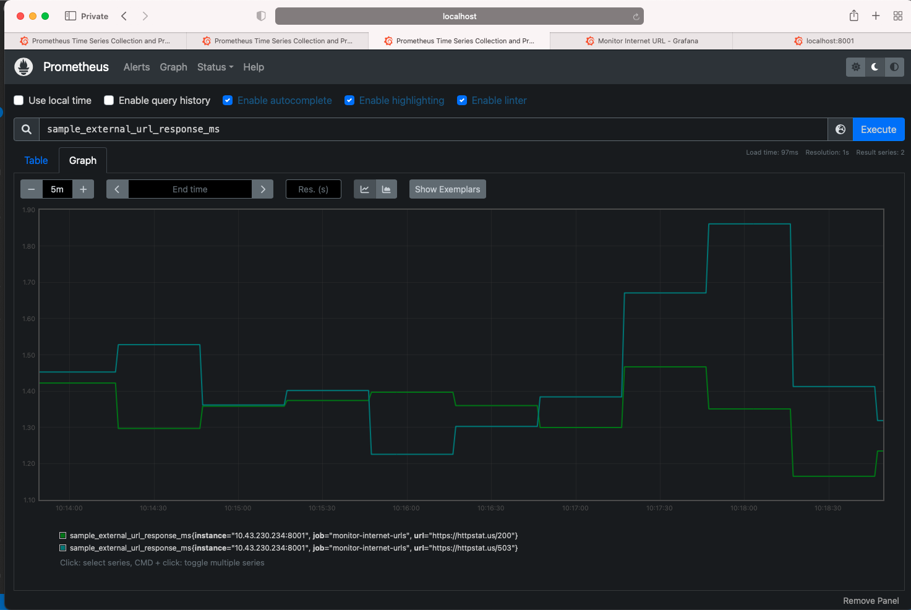
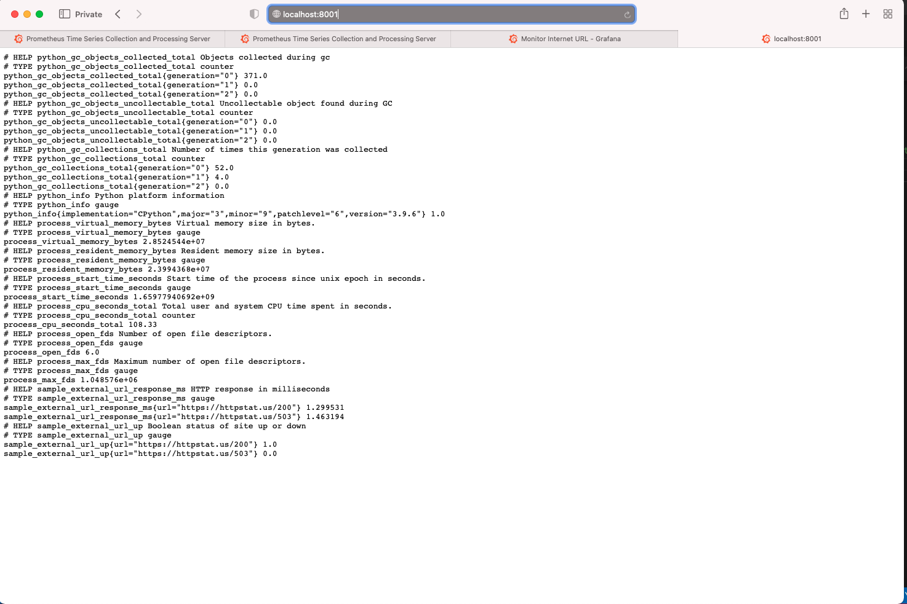

# Monitor Internet URLs

Monitor a list of internet URLs with Python instrumented using Prometheus and Grafana served on a Kubernetes Cluster

---

## Summary

-   A service written in Python that queries two sample urls every 5 seconds:    
    -   https://httpstat.us/200
    -   https://httpstat.us/503
-   The service checks:
    -   The external urls are up (based on http status code 200) return `1` if up, `0` if otherwise
    -   Response time in milliseconds
-   The service will run a simple http service that produces metrics (on `/metrics`) and output a Prometheus format when curling the service `/metrics` url

**Sample Response Format**:
```shell
sample_external_url_up{url="https://httpstat.us/200 "}  = 1
sample_external_url_response_ms{url="https://httpstat.us/200 "}  = [value]
sample_external_url_up{url="https://httpstat.us/503 "}  = 0
sample_external_url_response_ms{url="https://httpstat.us/503 "}  = [value]
```

## Technology Used

-   [Python3](https://www.python.org/)
-   [Prometheus](https://github.com/prometheus/client_python.git)
-   [Kubernetes](https://kubernetes.io/)
-   [Helm3](https://helm.sh/)
-   [Grafana](https://grafana.com/)

---

## Application's Screenshots

### Grafana Dashboard


### Prometheus Metrics

##### URL Response time in Prometheus


##### URL Status in Prometheus


##### Prometheus Targets


### Python Web Service

##### Python Web Service


---

## Set-up

1. Configure urls part in [urls.json](urls.json) with URLs you wish to monitor. This is currently configured with two urls as an example.

```
    {
    "urls": ["https://httpstat.us/200","https://httpstat.us/503"]
    }
```

2. Build Docker image and push to repository of your choosing

```shell
docker build -t $USERNAME/pythonmonitorurls .
docker push $USERNAME/pythonmonitorurls:$tagname
```

3. Create kubernetes cluster with 1.15+ using any Kubernetes cluster creation method.

- [Kubeadm](https://kubernetes.io/docs/setup/production-environment/tools/kubeadm/install-kubeadm/)
- [EKS](https://docs.aws.amazon.com/eks/latest/userguide/create-cluster.html)


4. Use `helm3` to install Prometheus & Grafana using prometheus-operator

```shell
#Install Helm3
https://helm.sh/docs/intro/install/
$ curl -fsSL -o get_helm.sh https://raw.githubusercontent.com/helm/helm/master/scripts/get-helm-3
$ chmod 700 get_helm.sh
$ ./get_helm.sh

#Install Prometheus & Grafana
helm repo add stable https://charts.helm.sh/stable
helm repo update
helm install prometheus stable/prometheus-operator
```

### Testing (Docker + Kubernetes)

To test with kubernetes cluster ensure that it is properly installed according to your operating system.

1.  Create kubernetes secret & update `imagePullSecrets` in [deployment.yaml](deployment.yaml).
```shell
kubectl create secret docker-registry regcred --docker-server=<your-registry-server> --docker-username=<your-name> --docker-password=<your-pword> --docker-email=<your-email>
```
2. In [deployment.yaml](deployment.yaml) change `image: akshaygirpunje/pythonmonitorurls:latest` to newly built Docker image you done in the set-up and also change the secret name.

3.  Run `kubectl deployment-prod.yaml and service.yaml`

```shell
kubectl apply -f deployment-prod.yaml
deployment.apps/monitor-internet-urls created

kubectl apply -f service.yaml
service/monitor-internet-urls created
```
-   View the deployment

```shell
kubectl get deployments

NAME                                  READY   UP-TO-DATE   AVAILABLE   AGE
monitor-internet-urls                 1/1     1            1           3h17m
```

4.  View the services & if you want to access the Prometheus,Grafana URL from outside of cluster change the type of `prometheus-grafana` & `prometheus-prometheus-oper-prometheus` services to NodePort or LoadBalancer from ClusterIP. 

```shell
kubectl get services
NAME                                      TYPE        CLUSTER-IP       EXTERNAL-IP   PORT(S)                      AGE
alertmanager-operated                     ClusterIP   None             <none>        9093/TCP,9094/TCP,9094/UDP   10h
kubernetes                                ClusterIP   10.96.0.1        <none>        443/TCP                      2d22h
monitor-internet-urls                     NodePort    10.111.11.17     <none>        8001:31060/TCP               3h18m
prometheus-grafana                        NodePort    10.103.255.157   <none>        80:31744/TCP                 10h
prometheus-kube-state-metrics             ClusterIP   10.107.212.55    <none>        8080/TCP                     10h
prometheus-operated                       ClusterIP   None             <none>        9090/TCP                     10h
prometheus-prometheus-node-exporter       ClusterIP   10.107.53.138    <none>        9100/TCP                     10h
prometheus-prometheus-oper-alertmanager   ClusterIP   10.109.48.122    <none>        9093/TCP                     10h
prometheus-prometheus-oper-operator       ClusterIP   10.97.212.254    <none>        8080/TCP,443/TCP             10h
prometheus-prometheus-oper-prometheus     NodePort    10.96.241.233    <none>        9090:31105/TCP               10h
```

5. Test services through `CLI` or `Web Browser`

- Check using CLI

```shell
curl http://10.111.11.17:8001/metrics
# HELP sample_external_url_response_ms HTTP response in milliseconds
# TYPE sample_external_url_response_ms gauge
sample_external_url_response_ms{url="https://httpstat.us/200"} 129
sample_external_url_response_ms{url="https://httpstat.us/503"} 120
# HELP sample_external_url_up Boolean status of site up or down
# TYPE sample_external_url_up gauge
sample_external_url_up{url="https://httpstat.us/200"} 1
sample_external_url_up{url="https://httpstat.us/503"} 0
```

-   Check `prometheus-grafana` , `prometheus-prometheus-oper-prometheus` & `monitor-internet-urls` services using web browser.

```shell
#Syntax
#http://{WorkerNodeIp or LB}:NodePort
http://{WorkerNodeIp or LB}:31150
http://{WorkerNodeIp or LB}:31744
http://{WorkerNodeIp or LB}:31060/metrics 
```

---
6. Add the service `monitor-internet-urls` endpoint to prometheus's target by adding `job_name` in [value1.yaml](values1.yaml) at `additionalScrapeConfigs` section as follows.

```shell
    additionalScrapeConfigs:
      - job_name: 'monitor-internet-urls'
        honor_labels: true
        static_configs:
        - targets: ['{WorkerNodeIp or LB}:31060']
```

7. Update the `prometheus-operator` repo with new service endpoint.
   - It will add the endpoint to prometheus's target.
   - Check `prometheus-grafana` , `prometheus-prometheus-oper-prometheus` services & modify type if require.
   - Check the target in prometheus dashboard at path http://{WorkerNodeIp or LB}/targets
```shell
 helm upgrade  prometheus stable/prometheus-operator -f values1.yaml
```

8. Configure & test `sample_external_url_up` & `sample_external_url_response_ms` metrics in prometheus at following path
```shell
 http://{WorkerNodeIp or LB}:31105/graph
```
9. Configure & test `sample_external_url_up` & `sample_external_url_response_ms` metrics in Grafana & create new Dashboard.
```shell
 http://{WorkerNodeIp or LB}:31744/dashboard/new?orgId=1
```
---

### Local Testing (Python Script)

1. Run ` python python_monitor_url.py`

```shell
python python_monitor_url.py
https://httpstat.us/200 Response Time ---> 0.24364
https://httpstat.us/200 Status Code ---> 1
https://httpstat.us/503 Response Time ---> 0.202487
https://httpstat.us/503 Status Code ---> 0
https://httpstat.us/200 Response Time ---> 0.140812
https://httpstat.us/200 Status Code ---> 1
https://httpstat.us/503 Response Time ---> 0.121563
https://httpstat.us/503 Status Code ---> 0
```

2. Curl `localhost`
```shell
curl localhost:8001/metrics

# HELP sample_external_url_response_ms HTTP response in milliseconds
# TYPE sample_external_url_response_ms gauge
sample_external_url_response_ms{url="https://httpstat.us/200"} 0.078517
sample_external_url_response_ms{url="https://httpstat.us/503"} 0.129249
# HELP sample_external_url_up Boolean status of site up or down
# TYPE sample_external_url_up gauge
sample_external_url_up{url="https://httpstat.us/200"} 1
sample_external_url_up{url="https://httpstat.us/503"} 0
```

3. Unit Test
```shell
python -m unittest test_python-monitor-url
https://httpstat.us/200 Response Time ---> 0.089305
.https://httpstat.us/503 Response Time ---> 0.11151
.https://httpstat.us/400 Response Time ---> 0.086959
.https://httpstat.us/200 Status Code ---> 1
.https://httpstat.us/503 Status Code ---> 0
.https://httpstat.us/400 Status Code ---> 0
.
----------------------------------------------------------------------
Ran 6 tests in 0.664s

OK

```
